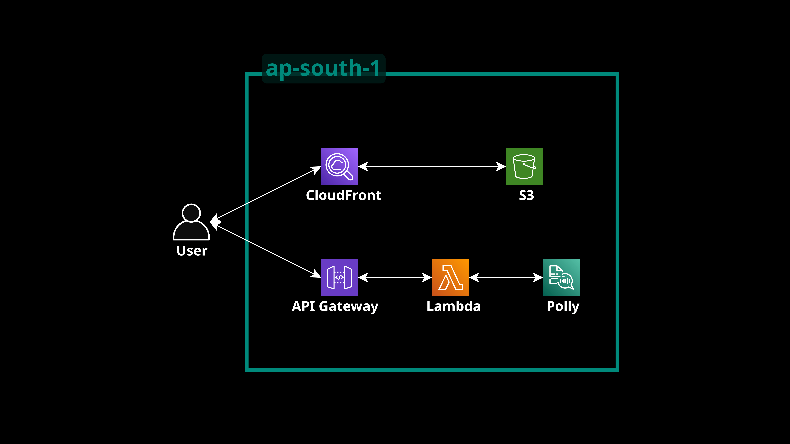

# Serverless Text-to-Speech Web Application (AWS Polly)

## Overview
A fully serverless web application that converts TXT and PDF files into speech using Amazon Polly.

This project demonstrates a cloud-native architecture using AWS managed services.

Users can:
- Upload a .txt or .pdf file
- Convert extracted text into speech
- Stream the generated MP3
- Download the audio file

---

## Architecture

### Frontend Layer
- Amazon S3 (Static Website Hosting)
- Amazon CloudFront (CDN with HTTPS)

### Backend Layer
- Amazon API Gateway (HTTP API)
- AWS Lambda (Python)
- Amazon Polly (Text-to-Speech)
- Amazon CloudWatch (Monitoring & Metrics)

### Flow

User (Browser)  
→ CloudFront  
→ S3 (HTML/CSS/JS)  

User  
→ API Gateway (POST /narrate)  
→ Lambda  
→ Amazon Polly  
→ Lambda  
→ API Gateway  
→ Browser (MP3 stream)

---

## Technical Implementation

Key concepts implemented:

- Serverless architecture
- Binary response handling via API Gateway
- Base64 encoding for audio streaming
- CORS configuration
- CloudFront + S3 static hosting
- CloudWatch metrics monitoring (Polly character usage)
- IAM role configuration for service permissions

---

## Tech Stack

Frontend:
- HTML
- CSS
- JavaScript
- PDF.js

Backend:
- Python (AWS Lambda)
- Amazon Polly
- API Gateway (HTTP API)

Cloud Services:
- Amazon S3
- Amazon CloudFront
- AWS Lambda
- Amazon API Gateway
- Amazon Polly
- Amazon CloudWatch

Deployment Region:
ap-south-1 (Mumbai)

---

## Monitoring

Polly usage is tracked via:

CloudWatch → Metrics → RequestCharacters

---

## Learning Outcomes

- Designed and implemented a complete serverless application
- Integrated AI services (Amazon Polly)
- Handled binary data via API Gateway
- Debugged CORS and Lambda invocation permissions
- Deployed static frontend via CDN

---

## Author
Ananya Gupta
